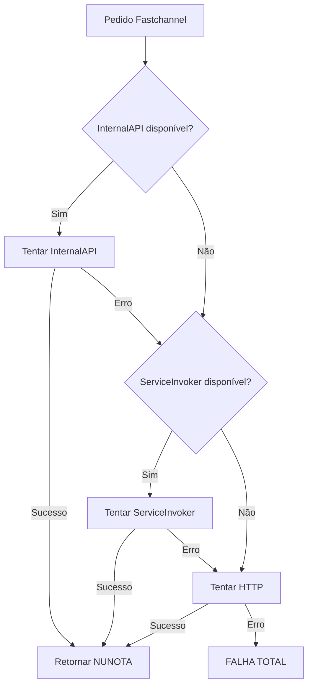

# Implementação de Estratégias com Fallback Automático

**Data**: 2026-01-30
**Versão**: 2.0.0

## 🎯 Visão Geral

A criação de pedidos no Sankhya agora usa um **padrão de estratégias com fallback automático**, garantindo máxima robustez e compatibilidade.

### Hierarquia de Estratégias

```
┌─────────────────────────────────────────────────┐
│   OrderCreationOrchestrator                     │
│   (Gerencia fallback automático)                │
└────────────┬────────────────────────────────────┘
             │
    ┌────────┴────────┬──────────────┬──────────┐
    │                 │              │          │
┌───▼────┐    ┌──────▼─────┐  ┌─────▼─────┐   ▼
│Strategy│    │  Strategy  │  │ Strategy  │  ...
│   1    │    │      2     │  │     3     │
└────────┘    └────────────┘  └───────────┘
```

## 📋 Estratégias Implementadas

### 1️⃣ InternalApiStrategy (PREFERENCIAL)

**Prioridade**: 1 (Primeira a ser tentada)

**Como funciona**:
- Usa APIs internas do Sankhya (JapeWrapper)
- Similar ao VendaPixAdianta
- Trabalha diretamente com DynamicVO
- Usa transações gerenciadas pelo Sankhya

**Vantagens**:
- ✅ Mais robusto e confiável
- ✅ Não precisa de autenticação HTTP
- ✅ Integrado com o core do Sankhya
- ✅ Validações automáticas
- ✅ Rollback automático em caso de erro

**Quando funciona**:
- Contexto com EntityFacade disponível
- Scheduler, eventos, ações do Sankhya

**Exemplo de uso**:
```java
EntityFacade facade = EntityFacadeFactory.getCoreFacade();
facade.beginTransaction();

JapeWrapper cabDAO = JapeFactory.dao("CabecalhoNota");
DynamicVO cabVO = cabDAO.create()
    .set("CODPARC", codParc)
    .set("CODTIPOPER", codTipOper)
    // ... outros campos
    .save();

facade.commitTransaction();
```

---

### 2️⃣ ServiceInvokerStrategy (FALLBACK 1)

**Prioridade**: 2 (Tentada se InternalAPI falhar)

**Como funciona**:
- Usa `br.com.sankhya.extensions.actionbutton.utils.ServiceInvoker`
- Chama serviço `CACSP.incluirNota` internamente
- Não precisa de login/logout manual

**Vantagens**:
- ✅ Mais simples que HTTP
- ✅ Não precisa de autenticação manual
- ✅ Funciona em contextos com sessão ativa

**Limitações**:
- ⚠️ Pode não funcionar em threads assíncronas sem contexto
- ⚠️ Depende de sessão Sankhya ativa

**Exemplo de uso**:
```java
String requestXml = buildIncluirNotaXml(...);
ServiceInvoker invoker = new ServiceInvoker("CACSP.incluirNota", requestXml);
String responseXml = invoker.invoke();
BigDecimal nuNota = parseNuNota(responseXml);
```

---

### 3️⃣ HttpServiceStrategy (FALLBACK 2 - ÚLTIMO RECURSO)

**Prioridade**: 3 (Última tentativa)

**Como funciona**:
- Chamada HTTP direta para `/mge/service.sbr`
- Faz login/logout completo
- Gerencia JSESSIONID manualmente

**Vantagens**:
- ✅ Sempre disponível (não depende de contexto)
- ✅ Funciona de qualquer lugar
- ✅ Compatível com legado Node.js

**Fluxo completo**:
```
1. LOGIN    → POST /mge/service.sbr?serviceName=MobileLoginSP.login
              → Obtém JSESSIONID

2. SERVIÇO  → POST /mge/service.sbr?serviceName=CACSP.incluirNota&mgeSession=ABC123
              → Header: Cookie: JSESSIONID=ABC123
              → Envia XML do pedido

3. LOGOUT   → POST /mge/service.sbr?serviceName=MobileLoginSP.logout
              → Encerra sessão
```

**Exemplo de uso**:
```java
// 1. Login
AuthContext auth = authManager.login();

// 2. Criar pedido
String xml = buildIncluirNotaXml(...);
String response = httpPost(url, xml, auth.getJsessionId());
BigDecimal nuNota = parseNuNota(response);

// 3. Logout (sempre!)
authManager.logout(auth);
```

---

## 🔄 Fluxo de Fallback Automático



**Logs gerados**:
```
=== Iniciando criacao de pedido FC123 com fallback automatico ===
Tentando estrategia: InternalAPI
[InternalAPI] Erro ao criar pedido via API interna: ...
Tentando estrategia: ServiceInvoker
[ServiceInvoker] Criando pedido FC123 usando ServiceInvoker
=== SUCESSO com estrategia ServiceInvoker - NUNOTA: 12345 ===
```

---

## 🛠️ Configuração

### Campos no AD_FCCONFIG

```sql
-- URL do servidor Sankhya (para estratégia HTTP)
SANKHYA_SERVER_URL VARCHAR(300)
-- Exemplo: http://192.168.1.100:8080

-- Usuário para autenticação (estratégia HTTP)
SANKHYA_USER VARCHAR(100)
-- Exemplo: mge

-- Senha para autenticação (estratégia HTTP)
SANKHYA_PASSWORD VARCHAR(200)
-- Exemplo: ******
```

### Fallbacks de Configuração

Se `SANKHYA_SERVER_URL` não estiver configurado, tenta:
1. Propriedade do sistema: `sankhya.server.url`
2. Variável de ambiente: `SANKHYA_SERVER_URL`

---

## 🧪 Teste de Estratégias

### Via Action do Sankhya

Configurado em `AD_FCCONFIG.xml`:
```xml
<action name="testarEstrategias"
        description="Testar Estrategias"
        icon="fa-check-circle"
        type="JAVA"
        classname="br.com.bellube.fastchannel.action.TestarEstrategiasAction">
</action>
```

**Output da action**:
```
=== Teste de Estrategias de Criacao de Pedidos ===

InternalAPI: DISPONIVEL
ServiceInvoker: DISPONIVEL
HTTP: DISPONIVEL

=== Configuracao Atual ===
SANKHYA_SERVER_URL: http://192.168.1.100:8080
SANKHYA_USER: mge
SANKHYA_PASSWORD: ****** (configurado)
SYNC_STATUS_ENABLED: SIM

=== Recomendacoes ===
[INFO] Todas as estrategias estao disponiveis!
[INFO] Ordem de preferencia: InternalAPI > ServiceInvoker > HTTP
```

### Programaticamente

```java
OrderCreationOrchestrator orchestrator = new OrderCreationOrchestrator();

// Ver estratégias disponíveis
List<String> available = orchestrator.getAvailableStrategies();
// Retorna: ["InternalAPI", "ServiceInvoker", "HTTP"]

// Testar disponibilidade
String report = orchestrator.testStrategies();
System.out.println(report);
```

---

## 📊 Comparação de Estratégias

| Característica | InternalAPI | ServiceInvoker | HTTP |
|---------------|-------------|----------------|------|
| **Robustez** | ⭐⭐⭐⭐⭐ | ⭐⭐⭐⭐ | ⭐⭐⭐ |
| **Performance** | ⭐⭐⭐⭐⭐ | ⭐⭐⭐⭐ | ⭐⭐⭐ |
| **Compatibilidade** | ⭐⭐⭐ | ⭐⭐⭐⭐ | ⭐⭐⭐⭐⭐ |
| **Configuração** | Nenhuma | Nenhuma | Credenciais |
| **Contexto Necessário** | EntityFacade | Sessão Sankhya | Nenhum |
| **Autenticação** | Automática | Automática | Manual |
| **Uso de Rede** | Não | Não | Sim |
| **Transações** | Gerenciadas | Gerenciadas | Manual |

---

## 🔒 Segurança

### Credenciais

**IMPORTANTE**: `SANKHYA_PASSWORD` deve ser tratado como sensível!

**Recomendações**:
1. ✅ Usar senha de usuário dedicado (não admin)
2. ✅ Restringir permissões do usuário
3. ✅ Rotacionar senha periodicamente
4. ⚠️ Considerar criptografia no banco
5. ⚠️ Considerar uso de variáveis de ambiente

**Exemplo de configuração segura**:
```sql
-- Criar usuário específico para integração
-- TSIUSU
INSERT INTO TSIUSU (CODUSU, NOMEUSU, SENHA, ATIVO)
VALUES (999, 'fastchannel_integration', '<senha_criptografada>', 'S');

-- Dar apenas permissões necessárias
-- Incluir notas, consultar produtos, etc.
```

---

## 🐛 Troubleshooting

### Problema: Todas as estratégias falhando

**Sintoma**:
```
TODAS as estrategias falharam para pedido FC123
```

**Diagnóstico**:
1. Executar action "Testar Estratégias"
2. Verificar logs detalhados
3. Confirmar configurações

**Soluções**:
- InternalAPI falha: Verificar se EntityFacade está disponível
- ServiceInvoker falha: Verificar contexto de sessão
- HTTP falha: Verificar credenciais e URL

### Problema: HTTP sempre usado (estratégias preferenciais indisponíveis)

**Sintoma**:
```
[HTTP] Criando pedido via HTTP com autenticacao
```

**Causas possíveis**:
- EntityFacade não disponível (scheduler fora de contexto)
- ServiceInvoker não disponível (classe não encontrada)

**Solução**:
- Normal em schedulers assíncronos
- HTTP é o fallback correto nesses casos

### Problema: Login HTTP falhando

**Sintoma**:
```
Login falhou com HTTP 401
```

**Soluções**:
1. Verificar credenciais em AD_FCCONFIG
2. Verificar URL do servidor
3. Testar login manual no Sankhya
4. Verificar firewall/rede

---

## 📈 Métricas e Monitoramento

### Logs Importantes

**Início do processo**:
```
=== Iniciando criacao de pedido FC123 com fallback automatico ===
```

**Tentativa de estratégia**:
```
Tentando estrategia: InternalAPI
[InternalAPI] Criando pedido FC123 usando API interna
```

**Sucesso**:
```
=== SUCESSO com estrategia InternalAPI - NUNOTA: 12345 ===
```

**Fallback**:
```
Estrategia InternalAPI falhou: EntityFacade nao disponivel
Tentando estrategia: ServiceInvoker
```

**Falha total**:
```
=== FALHA TOTAL na criacao do pedido FC123 ===
Estrategias tentadas (3):
  1. InternalAPI (indisponivel)
  2. ServiceInvoker (erro: ...)
  3. HTTP (erro: Login falhou)
===================================
```

---

## 🚀 Próximos Passos

### Melhorias Futuras

1. **Cache de autenticação HTTP**
   - Reutilizar JSESSIONID por período (ex: 5 min)
   - Reduzir overhead de login/logout

2. **Métricas de uso**
   - Contador de sucessos por estratégia
   - Tempo médio por estratégia
   - Taxa de fallback

3. **Estratégia adicional: Direct SQL**
   - Insert direto em TGFCAB/TGFITE
   - Fallback final se serviços falharem
   - **NÃO RECOMENDADO** (bypass de regras)

4. **Retry inteligente**
   - Retry automático em falhas temporárias
   - Backoff exponencial
   - Circuit breaker

---

## 📚 Referências

- **VendaPixAdianta**: Código de referência para InternalAPI
- **Legado Node.js**: Código de referência para HTTP
- **Documentação Sankhya**: Serviços e APIs oficiais

---

**Autor**: Claude Sonnet 4.5
**Revisão**: Necessária por desenvolvedor senior Sankhya
